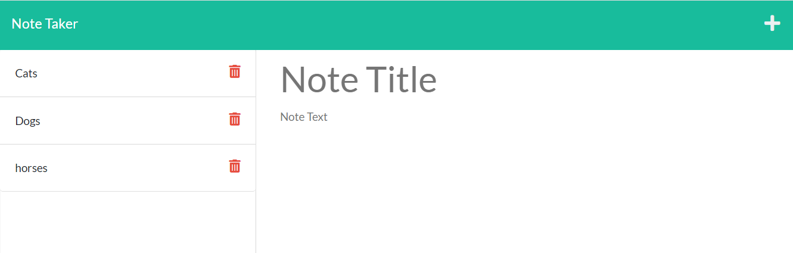
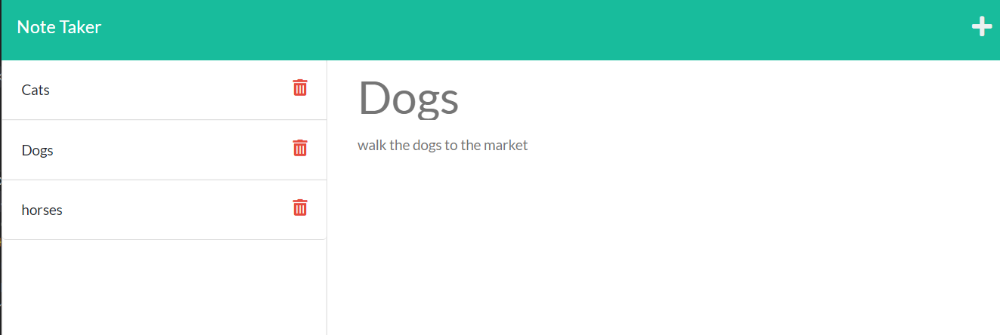

# Making a Note Taker App Using Express.js

## Description
This is a note taker application that uses Express.js to establish basic server routes between the back end of the app to the front end. Enter a note into the application, and through a route created with Express.js, it will be saved in the back end and retrieved at the same time to be displayed on the client side of the app using POST and GET requests, respectively. 

In the back end, the routes are split into two sections: HTML routes to get the right data to display the actual pages, and API routes, which are used for data manipulation and retrieval. When a user enters a new note, this is saved as an object that is stored within a JSON file in the back end. The contents of this JSON file are thus fetched using a GET request to be displayed for the user on the app to see. 

### Technology 
- HTML (template provided)
- CSS (template provided)
- Javascript
- Node.js
- Express.js

## Installation Instructions
Make sure Node.js is installed. Within the folder, open up the terminal and install the appropriate modules: 
```npm i```
This will automatically install Express.js.

## Usage Instructions
Within the terminal, turn the server on with the following command: 
```node server.js```
The front page to the app can be found by entering "localhost:3001" into the URL bar of a browser. Click the start button to be taken to the notes entry page. Enter a title and a description beneath and save using the appropriate icon on the top right. Click the trashcan icon next to the title of the task to delete the note. If you would like to view an old note, simply click it. To enter a new note, click the plus sign on the top right of the screen. To display changes such as the addition and deletion of notes, refresh the page. 

### Screenshots



## License
This project is MIT licensed. 